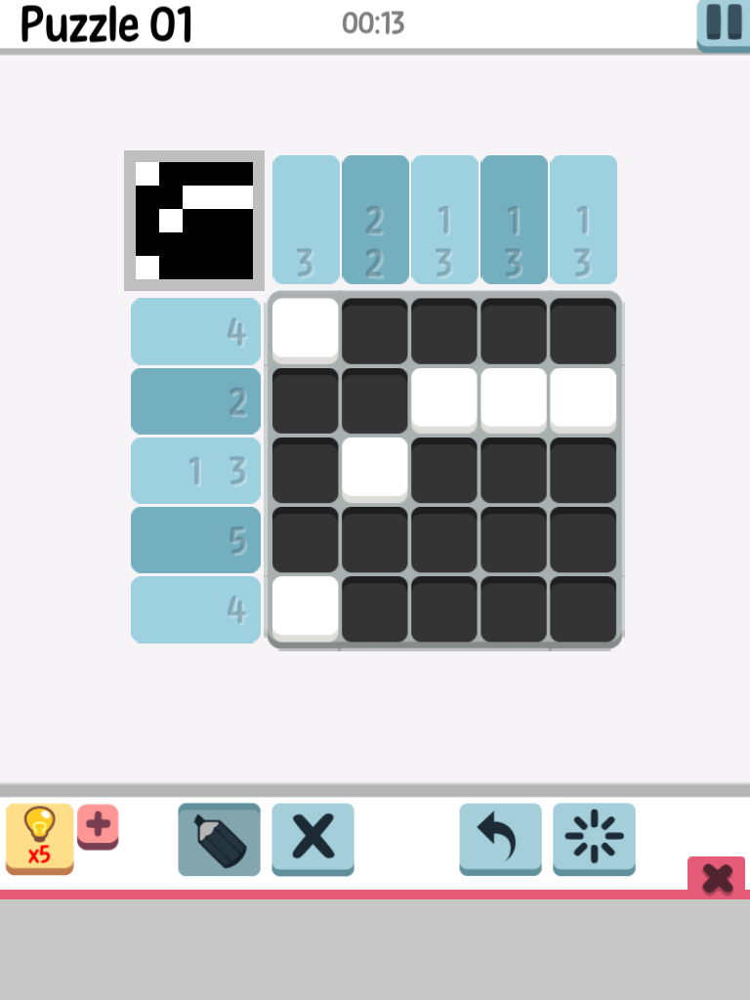

# LogicPic-Game-Solver
Dado un puzzle del juego para moviles LogicPic, generar un solucionador

El desafio consiste en que cada columna y fila, solo pueden estar coloreados ese numero de cuadrados. 

__Ejemplos en tablero de 3x3__: 

Filas donde solo existe existe 1 posibilidad :
  - (1,1):  101. 
  - (3)  :  111

| notacion      | BooleanCode   |
| ------------- |:-------------:| 
| (1,1)     | 101 | 
| (3)      | 111      |

Filas donde hay 2 posibilidades:

| notacion      | BooleanCode   |
| ------------- |:-------------:| 
| (2)           |          110  | 
|               |       011     |
|               |     ~~101~~   |
    
Filas donde hay 3 posibilidades

| notacion      | BooleanCode   |
| ------------- |:-------------:| 
| (1)           | 111           | 
|               | 110           |
|               | 111           |

idem para las columnas. 

~~Para ver solucion ir al [jupyter notebook](./jupyter/SolTebinski.ipynb)~~
